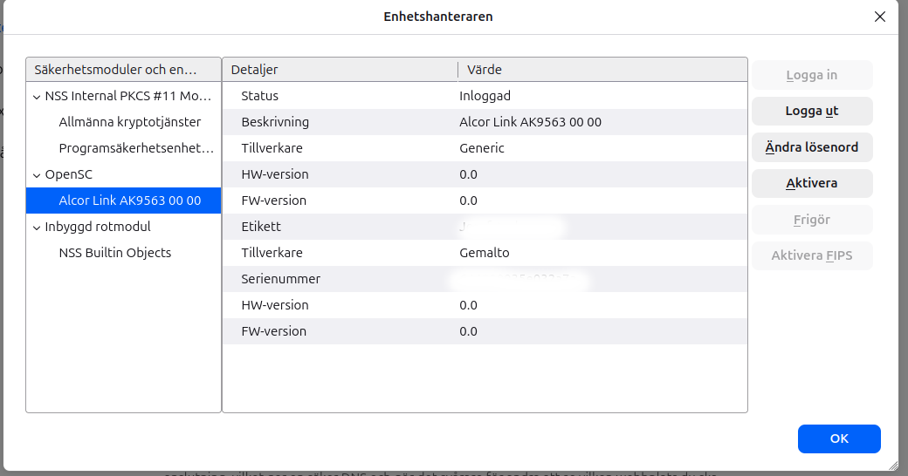

# Smart Card Setup Guide

This guide explains how to set up smart card authentication for Citrix and Firefox on Ubuntu (non-WSL).

## Prerequisites

- DevBase Core installed on native Ubuntu (not WSL)
- A supported smart card reader (USB CCID compatible)
- A smart card with valid certificates

DevBase automatically installs:

- **Firefox** from Mozilla's APT repository (required for smart card support)
- **OpenSC** smart card utilities and PKCS#11 module
- **pcscd** PC/SC smart card daemon
- **pcsc-tools** for testing smart card detection

## Step 1: Enable pcscd and Install Citrix

```bash
# Enable the smart card daemon
sudo systemctl enable --now pcscd

# Verify your card reader is detected
pcsc_scan
# Press Ctrl+C to exit after you see your reader

# Install Citrix Workspace App
devbase-citrix
```

Follow the Citrix installation prompts. When complete, smart card support will be available in Citrix.

## Step 2: Configure Firefox for Smart Card Support

DevBase installs Firefox from Mozilla's APT repository (not Ubuntu's snap) because the snap version has AppArmor restrictions that prevent smart card access.

If Firefox was launched before running this command, the profile already exists and configuration is automatic. Otherwise:

```bash
# Launch Firefox once to create a profile
firefox &

# Close Firefox, then configure OpenSC
devbase-firefox-opensc
```

You should see:

```text
OpenSC configured for Firefox smart card support.

Profile: /home/username/.mozilla/firefox/xxxxxxxx.default

Next steps:
  1. Restart Firefox
  2. Insert your smart card
  3. Go to: Settings → Privacy & Security → Security Devices
  4. You should see 'OpenSC' with your card reader listed
```

## Step 3: Verify Smart Card in Firefox

1. Insert your smart card
2. Open Firefox
3. Navigate to: **Settings → Privacy & Security → Security Devices**
4. You should see **OpenSC** in the left panel
5. Click on **OpenSC** - your card reader should be listed
6. If the card is inserted, you'll see your certificate information



## Step 4: Test Smart Card Authentication

Navigate to a site that requires smart card authentication, for example:

- Your organization's smart card-protected portal
- A test site like: <https://test.example.com> (replace with your actual test URL)

When prompted, select your certificate from the smart card.

## Troubleshooting

### Firefox installed from snap (won't work)

If Firefox was previously installed as a snap:

```bash
# Check installation source
apt-cache policy firefox

# If it shows snap, reinstall from Mozilla repo
sudo snap remove firefox
sudo dpkg -r firefox  # Remove transitional package
sudo apt update
sudo apt install firefox
```

## Additional Resources

- [Ubuntu Smart Card Documentation](https://ubuntu.com/server/docs/smart-cards)
- [OpenSC Documentation](https://github.com/OpenSC/OpenSC/wiki)

## Related DevBase Commands

| Command | Description |
|---------|-------------|
| `devbase-firefox-opensc` | Configure Firefox for smart card support |
| `devbase-citrix` | Install Citrix Workspace App |
| `devbase-citrix --check` | Check available Citrix version |
